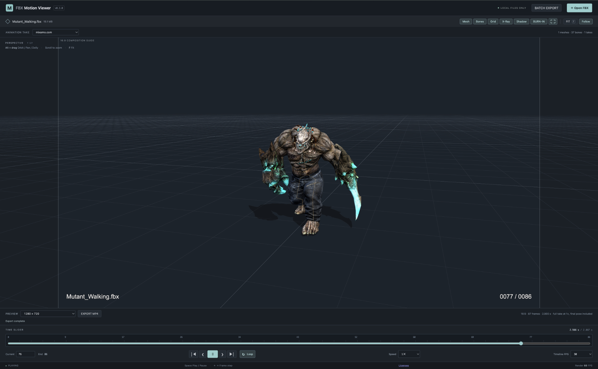
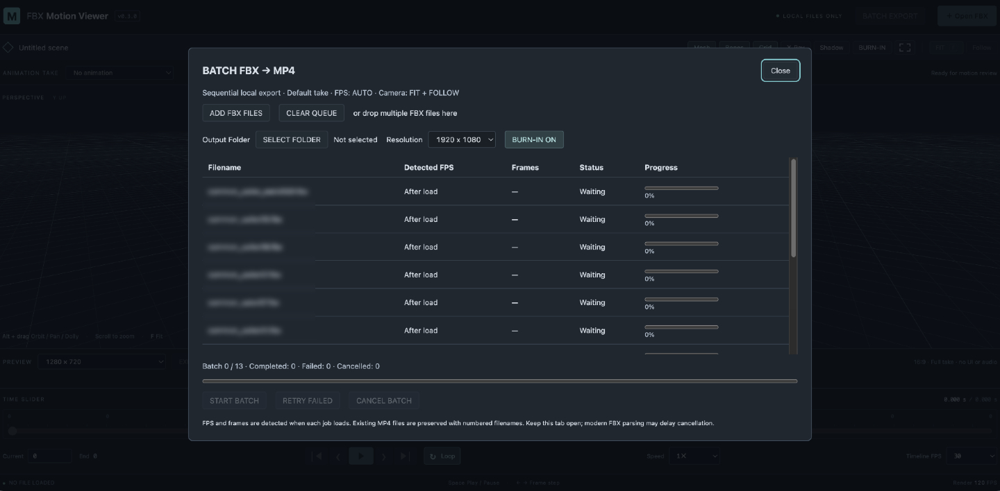

# FBX Motion Viewer

**v0.4.0** — A browser-based FBX animation viewer for VFX and motion-capture review. Built with React, TypeScript and Three.js. FBX files are processed locally in your browser.

## Try it online

[Open FBX Motion Viewer](https://sonicpower1970.github.io/FBX-Motion-Viewer/)

FBX files are processed locally in your browser and are not uploaded to a conversion server. Chrome / Chromium-based browsers are recommended. The site downloads application assets over HTTPS; export API availability depends on your browser and system.

## Screenshots

### FBX Motion Viewer



Interactive FBX playback with timeline controls, FIT/FOLLOW camera,
skeleton display, frame guide, burn-in, and MP4 export.

### Batch FBX → MP4



Sequential batch conversion of multiple FBX files to MP4 with automatic
FPS detection, FIT + FOLLOW camera, burn-in, and output-folder selection.

> **Screenshot sample assets:** Character and animation data shown in the screenshots are from Adobe Mixamo and are used only to demonstrate FBX Motion Viewer. Mixamo and the sample assets are not included with this project.

## Features

- FBX drag & drop; skeleton-only and skinned meshes; multiple animation takes.
- Playback, loop, timeline scrub, frame stepping and 0.25× / 0.5× / 1× / 2× playback speed.
- Maya-style camera controls, FIT and ground-plane FOLLOW.
- Infinite grid, X-Ray Bones and ground shadows.
- Dark / Light viewport background, with dark application UI.
- Still PNG capture of the current viewport/frame, including optional burn-in and 16:9 frame-guide composition; static FBX supported.
- 16:9 composition guide and optional filename/frame-counter burn-in.
- Offline frame-by-frame MP4 rendering and sequential **Batch FBX → MP4**.
- Batch FPS metadata detection and built-in legacy FBX fallback, including tested FBX 6000 data.

## Supported platforms and browsers

| Platform | Status |
|---|---|
| macOS Apple Silicon + Chrome | Verified on hardware |
| Intel Mac | Package available; hardware validation pending |
| Windows x64 / ARM64 | Packages available; hardware validation pending |
| Linux x64 / ARM64 | Packages available; hardware validation pending |

One Web application serves all platforms. Chrome / Chromium is the primary target. WebGL 2 and hardware acceleration are required. MP4 export requires WebCodecs with an available H.264 encoder; availability depends on the browser, OS and GPU.

Run through **localhost or HTTPS**, not by double-clicking HTML. `showSaveFilePicker()` is detected at runtime: single export falls back to an ordinary browser download if unavailable. Batch export requires `showDirectoryPicker()` and writable directory access; it reports an unavailable feature instead of silently downloading many files. Native pickers require a user action. Other browsers may support viewing but lack export APIs.

## Installation / local use

Install Node.js **24.21.0 or a newer 24.x** using your preferred version manager. `.nvmrc` and `.node-version` pin 24.21.0. Download/extract the source or use your own checkout, then:

```sh
cd FBX-Motion-Viewer
npm ci
npm run dev
```

Open the printed localhost URL in Chrome. Stop the server with Ctrl+C. `scripts/with-node.sh` is an optional helper for a locally provisioned runtime under `.tools/`; ordinary npm commands work across platforms and do not require that helper.

### Offline packages

When distributed, extract the entire ZIP for your OS/CPU and keep its folder structure. Node is bundled; users do not need npm or an Internet connection to run the package.

| ZIP suffix | Launcher |
|---|---|
| `macos-apple-silicon`, `macos-intel` | `Start Viewer.command` or `FBX Motion Viewer.app` |
| `windows-x64`, `windows-arm64` | `Start Viewer.cmd` |
| `linux-x64`, `linux-arm64` | `Start Viewer.sh` (or run with `sh`) |

The launcher starts a static server bound only to `127.0.0.1`, chooses an available port and opens the default browser. Open its URL in Chrome if needed. Leave the terminal open; use Ctrl+C there to stop. Closing the browser tab does not stop the server.

On macOS, move the **whole distribution folder** to its intended location before dragging its `.app` into the Dock. The app opens the adjacent `.command` in Terminal and then exits; the Dock indicator is not a server-status indicator. Reopening starts another server. Do not move the `.app` alone. Re-register it after replacing the distribution folder.

Packages are unsigned and not notarized. OS security prompts may apply. Non-Apple-Silicon packages still need hardware validation. Release ZIPs belong in release downloads, not in the source repository.

## Usage and camera controls

Drop one FBX into the viewport or choose **Open FBX**. Select an Animation Take when multiple takes exist. Click the viewport before using shortcuts; focused form controls keep their normal keyboard behavior.

| Action | Control |
|---|---|
| Orbit | Alt + left drag |
| Pan | Alt + middle drag |
| Dolly | Alt + right drag |
| Zoom | Mouse wheel / trackpad scrolling |
| One-shot fit | F |
| FIT mode | FIT toggle (default ON); enabling fits the current pose |
| Follow motion | FOLLOW toggle; follows XZ movement, not vertical movement |
| Play / pause | Space / playback button |
| Previous / next frame | Left / right arrow or buttons |
| Start / end | Home / End or buttons |
| Scrub | Timeline or Current frame input, then Enter |
| Display | Mesh / Bones / Grid / X-Ray / Shadow toggles |

FIT and FOLLOW are independent. FIT ON fits at relevant boundaries, including loop start and export start. FIT OFF preserves manual composition. With FOLLOW ON + FIT OFF, loop transitions translate the camera and orbit target together to preserve their relationship to the subject; export rebases that relationship to START. Orbit, pan and dolly remain available while following. Trackpad behavior depends on OS/browser settings; a three-button mouse is the most reliable Maya-style input.

### Frame guide and burn-in

The four-corner toolbar icon toggles a centered 16:9 guide. It does not change the camera and is never rendered into MP4. The 720p/1080p export projection matches the guide region. Current Viewport export uses the viewport aspect ratio and need not be 16:9.

**BURN-IN** toggles both filename (bottom left) and frame counter (bottom right), in the Viewer, PNG and MP4. FBX files without animation display filename only. Long names shrink and, when necessary, receive middle ellipsis. Paths are excluded. Burn-in is positioned inside the guide when the guide is enabled.

### Viewport background and still PNG capture

The **DARK / LIGHT** toolbar toggle changes only the viewport background and helper contrast. DARK (default) uses `#1c232b`; LIGHT uses neutral gray `#b8b8b8`. Application UI, mesh materials, textures, lighting and camera settings are unchanged.

Press **CAPTURE**, beside EXPORT MP4, to save the current camera composition and animation frame as PNG. Files without animation can also be captured. Capture does not fit the camera, seek a new frame or reinitialize Follow.

With the 16:9 guide ON, capture saves the guide's interior at **1920×1080**, without guide lines, labels or the outside overlay. With the guide OFF, it saves the full viewport at its CSS pixel dimensions, without multiplying output by Retina scaling. Optional burn-in uses the shared Viewer/MP4 layout.

Animated filenames include the current frame, such as `walk_f0025.png`; static filenames are `prop.png`. Parent paths are excluded. Supported browsers open a Save File Picker; other browsers download the PNG. Cancelling the dialog is normal. The chosen background also applies to single and batch MP4 exports.

### Single MP4 export

Choose 1280×720, 1920×1080 or Current Viewport and press **EXPORT MP4**. A supported browser asks for the save destination before rendering; cancelling that picker starts no rendering. Otherwise the completed file uses normal browser download behavior.

Export covers the selected take, at Timeline FPS and original speed (1×), with no audio or application UI. Every output frame is evaluated at its explicit animation time, rendered and encoded; this is not a real-time screen recording. The end pose is included. Current Viewport uses drawing-buffer pixels, rounding odd dimensions down to even values.

FIT/FOLLOW and display settings, including DARK / LIGHT, apply. With FIT OFF, the camera composition is preserved; FOLLOW rebases the relative composition to START. Export uses a separate camera. Completion, cancellation and failure restore the original Viewer animation/playback state. Progress and final status are displayed.

## Batch export

Open **BATCH EXPORT**, choose multiple FBX files or drop them into the queue, then **SELECT FOLDER** and **START BATCH**.

- Background inherits the current Viewer DARK / LIGHT selection.
- Each file uses its default take, with **FIT + FOLLOW fixed ON**.
- Resolution: 1080p (default) or 720p. Burn-in defaults to ON.
- FPS is **AUTO**, read from FBX time metadata. Unknown metadata uses a visible **30 fps (fallback)**. Batch has no manual FPS override.
- Files render sequentially with the same offline encoder used by single export.
- Existing output filenames are avoided using suffixes such as `motion (1).mp4`.
- A failed job does not stop later jobs. **RETRY FAILED** retries failed jobs only.
- **CANCEL BATCH** stops work; saved files remain. Remaining jobs can be resumed.
- Closing the panel returns to the preserved Viewer asset, camera, frame and settings.

Keep the tab open during processing. FPS/frame counts appear after each file loads. Batch requires folder-access APIs; single-export download fallback does not provide batch folder saving. See [batch design and limitations](docs/v0.3.0.md).

## FPS

The Viewer timeline defaults to 30 fps and offers 23.976, 24, 25, 29.97, 30, 50, 59.94 and 60. Fractional rates use 24000/1001, 30000/1001 and 60000/1001. Internal time is seconds; changing FPS does not change the current animation time. Frame stepping always advances one timeline frame, independent of playback speed.

Start Frame is 0; End Frame is `ceil(duration × FPS)` with floating-point boundary correction. A two-second take at 30 fps has frames 0–60, including the end pose. The final sample clamps to the exact animation end. Render FPS is measured drawing frequency, separate from Timeline FPS. Batch AUTO detection does not change the Viewer's manual timeline setting. Original start-frame restoration and drop-frame timecode are not implemented.

## Legacy FBX

Modern files use Three.js FBXLoader. Older files automatically use the bundled **ufbx WASM worker** and are converted in browser memory. No Blender, Autodesk FBX SDK installation or external conversion server is required.

FBX 6000 skeleton animation has been tested privately; public Maya 6100 fixtures cover meshes, skinning and multiple takes. Those tests do not imply complete FBX compatibility. Public fixture provenance and licenses are in [the fixture README](tests/fixtures/legacy/README.md). See [legacy implementation and rebuilding WASM](docs/legacy-fbx.md).

## Privacy / local processing

FBX data is processed in the browser and is not uploaded. The application has no asset-upload endpoint, analytics or external fonts. Embedded textures are preferred; unresolved or unsupported textures receive a fallback material and warning. External texture URLs and filesystem references are not automatically fetched. Loaded FBX files are not retained in browser storage by the Viewer.

A hosted version still makes normal network requests to obtain application files, including JS and WASM; the hosting provider can receive ordinary access information. This is different from uploading FBX content. The offline package serves those assets from localhost and has no automatic updater. Development uses local Vite/HMR connections.

## GitHub Pages

The Web Viewer is deployed through `.github/workflows/pages.yml` from `main`. The workflow checks lint, types and unit tests, builds the Pages output and deploys only `dist-pages/`, including `legal/`. Release tags and offline packages are independent of this workflow.

```sh
npm run build:pages
```

This creates **dist-pages/** using relative asset URLs, suitable for an unknown Project Pages repository path. JS, CSS, workers, WASM and license links resolve below that path. An optional `PAGES_BASE` environment variable can specify a fixed prefix such as `/FBX-Motion-Viewer/`. Normal `npm run build` separately creates **dist/** for offline packaging.

Any deployment must include the entire generated directory, including **legal/**. Pages needs HTTPS for export APIs. Folder access, file saving and encoder availability remain browser-dependent. No server-side FBX processing is required. A local nested-path browser test is available via `npm run test:pages` after building; actual hosted validation remains necessary.

## Known limitations

- Input limit: 500 MiB. This is a guard, not a large-file performance guarantee; memory use can greatly exceed input size.
- Legacy parsing/baking runs in a cancellable worker. Modern FBXLoader parsing and Three.js scene construction still contain synchronous work.
- Legacy transform animation is baked at 120 Hz, skinning uses up to four influences, dual-quaternion skinning is approximated with linear skinning, and legacy blend shapes are not supported.
- Prefer baked animation. DCC constraints, special deformers, animation layers and proprietary materials may not reproduce exactly. External texture selection is not implemented.
- FIT uses the current pose, not the whole motion envelope. Source scale/root motion is not normalized by the Viewer.
- MP4 output is buffered in memory with a 512 MiB limit. Long/high-resolution exports depend on available memory and encoder resources. Closing the tab interrupts export. Failed/cancelled saves may leave an empty file selected by the browser.
- Batch uses one default take per file. Filename collision checks cannot prevent another application from creating the same file during a write.
- Large production skinned FBX 6000 files, 500 MiB files and non-Apple-Silicon hardware still need validation.

## Development

```sh
npm run lint
npm run typecheck
npm test
npm run build
npm run build:pages
npm run test:e2e
npm run test:pages
```

`npm run check` runs lint, typecheck, unit tests and the normal build. Browser tests use installed Google Chrome. Optional private test input can be supplied with `FBX_LEGACY_SAMPLE`; never commit private assets or test output. Tests without that variable use public/synthetic fixtures. Ordinary builds use checked-in WASM; Emscripten is only needed to rebuild the native bridge.

### Build offline ZIPs

A macOS/Linux packaging host needs `tar`, `unzip` and `zip`:

```sh
npm run package:offline
npm run package:offline -- --all
npm run test:offline
```

The first package build downloads official Node runtimes and verifies SHA-256 checksums. Cached runtimes live under `.tools/`. Six target ZIPs and checksum files are generated under `releases/`, which is ignored by Git. Offline tests exercise the package on the current Mac plus server behavior; they do not certify all target OSes.

Packages include the Viewer, Node runtime, launchers, licenses and Mediabunny's matching source. Source assets, private FBX files and development dependencies are not bundled. A large Three.js bundle warning is currently expected.

See [public release checklist](docs/public-release.md), [v0.4.0 release notes](docs/release-notes-v0.4.0.md), [v0.4.0 implementation and validation](docs/v0.4.0.md), [specifications](docs/specifications.md) and [roadmap](docs/roadmap.md). Historical version documents describe earlier behavior; this README describes v0.4.0.

## License

Original project code: [MIT](LICENSE), Copyright (c) 2026 Koji Matsunaga.
Third-party components retain their own licenses; see [THIRD_PARTY_NOTICES.md](THIRD_PARTY_NOTICES.md). In particular, Mediabunny is **MPL-2.0**, not MIT. Built applications provide a **Licenses** link with notices, full license texts and the exact matching Mediabunny source archive. Offline packages also retain `third-party-sources/`.

FBX is a file format associated with Autodesk. This project is independent and is not affiliated with, endorsed by or an official product of Autodesk. Autodesk logos and product icons are not used as project branding.
